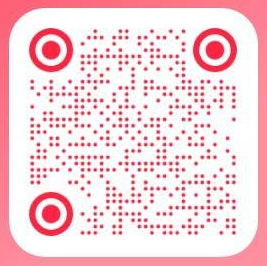

  

    

      
      微信公众号
    

    

      
      小红书
    

  

  
  

    <a href="https://space.bilibili.com/你的ID" target="_blank">
      <i class="fab fa-bilibili"></i> Bilibili
    </a>
    <a href="https://www.douyin.com/user/你的ID" target="_blank">
      <i class="fab fa-tiktok"></i> 抖音
    </a>
    <a href="https://github.com/你的ID" target="_blank">
      <i class="fab fa-github"></i> GitHub
    </a>
    <a href="futurearray@outlook.com" target="_blank">
      <i class="fas fa-envelope"></i> Email
    </a>
  

